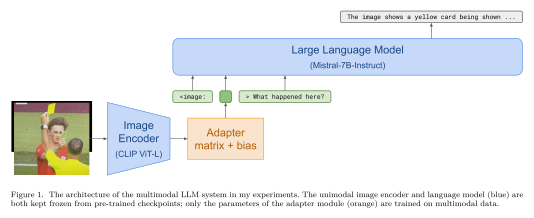

# Combining Pre-Trained Unimodal Models with a Single Fully-Connected Layer

  

> **Abstract:** Large vision-language models are expensive to train from scratch. However, recent work has demonstrated that pre-trained unimodal models can be combined by connecting them with a learned "adapter". In this project I experiment with a single fully-connected layer as the adapter and show that the resulting system has nontrivial multimodal capabilities.

This is Quinn Tucker's term project for Natural Language Processing I in Fall 2023.

My written report is in `Quinn_NLP_Term_Project_Report.pdf`. The rest of this repository contains my code and trained checkpoints.

## How to train the adapter models

You will need to be in a Python environment with `numpy`, `torch`, `torchvision`, `transformers`, `datasets`, `tqdm`, and `wandb`, and one or more GPUs with collectively at least 30-40 GB of VRAM (to be able to load the Mistral language model).

First, embeddings need to be computed for images in the CC12M dataset. To do this, run the following script:

    $ python3 conceptual_12m.py

This will automatically download the CC12M image URLs, and start downloading and processing individual images. The computed embeddings are stored in `./cc12m_image_embeddings/`. Run this script for as long as you want to generate enough embeddings for training. This may take a while.

Then, to train an adapter module, run:

    $ python3 train.py --num_adapter_tokens 1

This will use the CC12M captions and the computed embeddings to train the adapter module. Checkpoints will be saved in `./checkpoints/`.

## How to evaluate the system using an adapter checkpoint

For this, run:

    $ python3 test.py checkpoints/adapter_playful-mountain-15.pt --num_adapter_tokens 1

I also provide two other checkpoints for adapters that emit 2 and 5 adapter tokens per image.

Once the models load, you will be dropped into a prompt that says `User:`. From here, you can type the following commands. (All image names/paths must be relative to the `./images/` directory.)
 - `/tokens reverse.png`: Prints a list of the most similar LM vocabulary tokens to the adapted image embedding, for the specified image.
 - `/randvqa`: Chooses a random image+question from the VQAv2 validation set and asks the model that question about that image. To use this you must have the data extracted to these locations:
   - `./VQAv2/v2_OpenEnded_mscoco_val2014_questions.json`: The VQAv2 validation questions.
   - `./VQAv2/val2014/COCO_val2014_*.jpg`: The COCO validation images. (VQAv2 uses images from the COCO dataset.)
 - `/reset`: Clears the prompt history and starts a new conversation.
 - Any other text will be sent to the model as a user message/prompt.
   - To include an image in your prompt, use the following syntax: `<image:reverse.png>`. In this example, `reverse.png` will be replaced by the adapted image embedding token(s).

Press Ctrl-C twice to exit the program.
